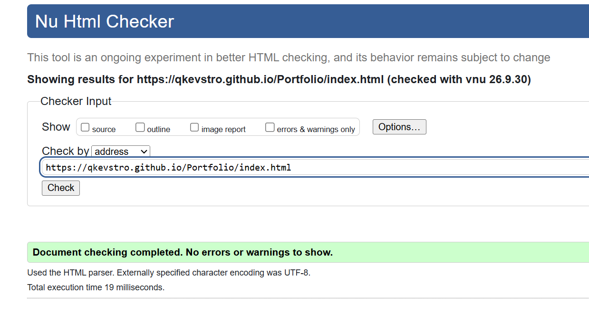

# Personal Portoflio Websida - Kevins Skripka TE24

## Beskrivning
Detta är min personliga hemsida skapad som ett skolprojekt. 

## Teknologiker
* **HTML5** - Semantisk struktur och innehåll
* **CSS** - Styling, responsiv design (Flexbox/Grid) och layout.

## Responsiv Design
För att hemsidan ska se bra ut på alla enheter som mobil, dator och så vidare har jag använt CSS Media Queries

## Motivering
* max-width: 500px (Mobiler): jag behövde byta några saker, mest av saker var bilder i kollumer, de overlappade och de var squished tillsammans så jag behövde ändra storleker på bilder men också använde en annan grid på collumn, t.ex om dator hade repeat(2, 1fr) då behövde jag skriva repeat(1, 1fr) på mobiltelefoner som de är i en kollumn så de går inte overlappar eller sånt. Jag också bytte andra saker som body's padding så allting blir inte förtrångt när skärmen minskas.

## valideringsbevis

