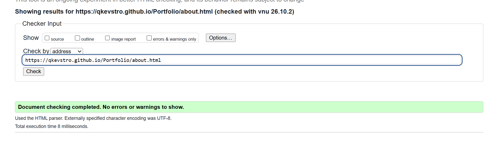
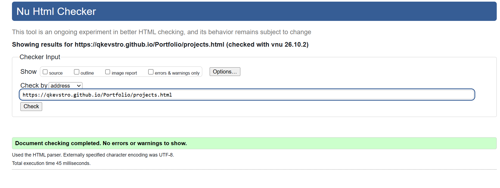
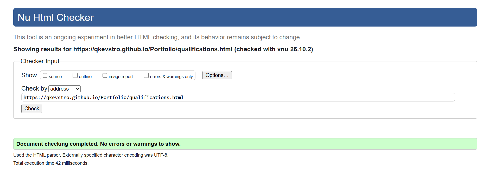
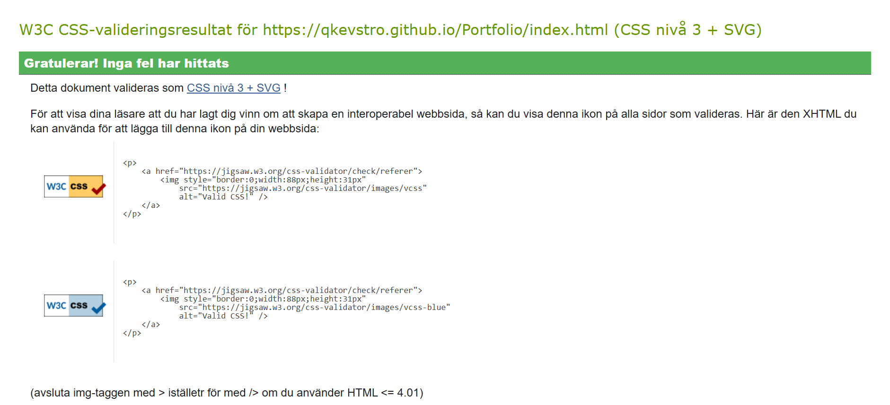

# Personal Portoflio Websida - Kevins Skripka TE24

## Beskrivning
Detta är min personliga hemsida skapad som ett skolprojekt. 

## Teknologiker
* **HTML5** - Semantisk struktur och innehåll
* **CSS** - Styling, responsiv design (Flexbox/Grid) och layout.

## Responsiv Design
För att hemsidan ska se bra ut på alla enheter som mobil, dator och så vidare har jag använt CSS Media Queries

## Motivering
* min-width: 501px (skärmar större än mobil/Dator): Jag byggde sidan enligt mobile-first, vilket innebär att grundkoden i CSS anpassades för mobiltelefoner först. På mobiler använder jag en kolumn (repeat(1, 1fr)) för att bilderna inte skulleöverlappa eller bli squishade typ, samt minskade padding på body så att innehållet inte blev för trångt. Därefter använde jag för större skärmar, där jag ändrade griddet till två kollumner och justerade bildstorlekerna samt marginalerna så att layouten nyttjar och den bredare skärmen bättre

## valideringsbevis
index.html bevis

about.html bevis

projects.html bevis

qualifications.html bevis

style.css bevis

